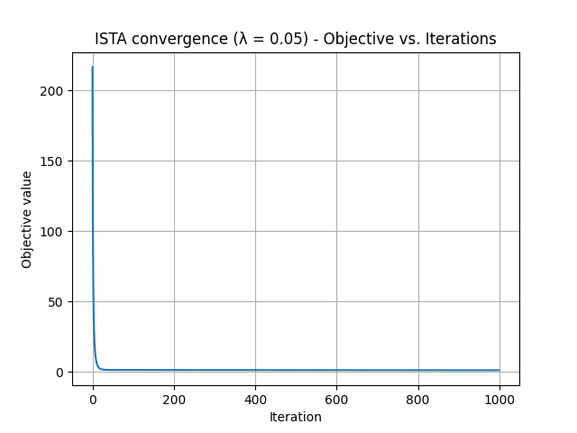
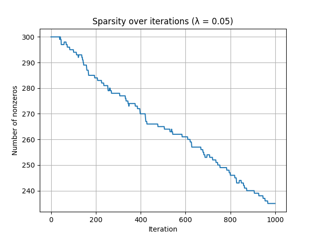
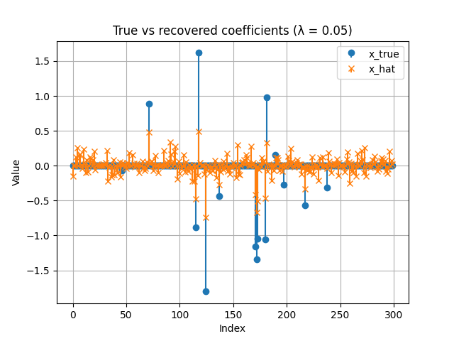
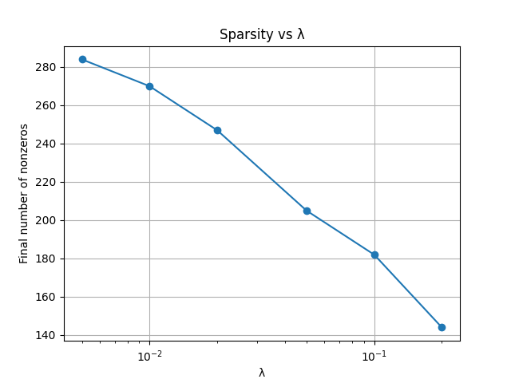
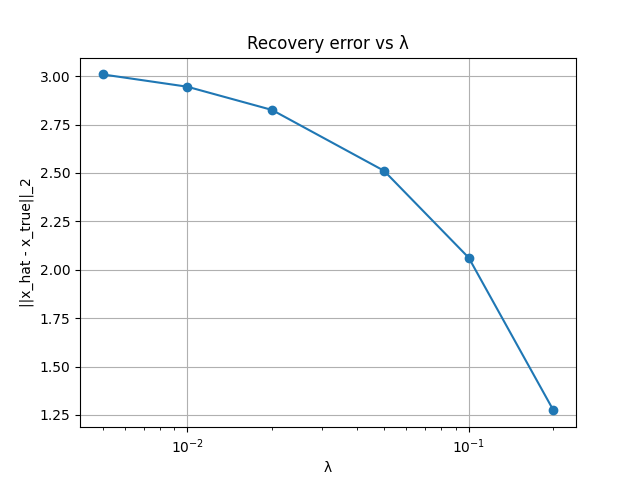

# ℓ₁-Regularized Least Squares (LASSO) via Proximal Gradient Methods

## Overview
This project studies how **objective structure influences optimization behavior**, using ℓ₁-regularized least squares (LASSO) as a concrete example. Rather than relying on existing solvers, I implemented **proximal gradient descent (ISTA)** from scratch to understand how sparsity emerges *during* optimization and how algorithm behavior reflects the geometry imposed by the ℓ₁ penalty.

The goal of this project is not efficiency, but **insight**: connecting optimization theory, objective geometry, and observed algorithm dynamics.

---

## Motivation
This project was built as part of my effort to understand **how optimization theory translates into algorithmic behavior in practice**, and to move beyond treating solvers as black boxes. It reflects my interest in structured optimization, sparse learning, and the interaction between geometry, algorithms, and empirical behavior.

---

## Problem Formulation
The optimization problem studied is the ℓ₁-regularized least-squares problem:

$$
\min_x \; \frac{1}{2}\|Ax - b\|_2^2 + \lambda \|x\|_1
$$

where:
- $A \in \mathbb{R}^{m \times n}$ is the design matrix  
- $b \in \mathbb{R}^m$ is the observation vector  
- $x \in \mathbb{R}^n$ is the parameter vector  
- $\lambda > 0$ controls the tradeoff between data fidelity and sparsity  

The quadratic loss is smooth with a Lipschitz-continuous gradient, while the ℓ₁ term is convex but non-smooth. Although the objective is convex, the non-smooth geometry introduced by the ℓ₁ norm makes standard gradient descent inappropriate.

---

## Why Proximal Gradient Methods?
This objective has a **composite structure**:

$$
f(x) + g(x)
$$

where:
- $f(x) = \frac{1}{2}\|Ax - b\|_2^2$ is smooth  
- $g(x) = \lambda \|x\|_1$ is convex but non-smooth  

Proximal gradient methods are designed specifically for problems of this form. Instead of smoothing or approximating the ℓ₁ term, they **exploit its structure directly** by alternating between:
- a gradient step on the smooth loss, and  
- a proximal step for the non-smooth regularizer.

This makes them a natural choice for ℓ₁-regularized optimization.

---

## ISTA Update Rule

The **Iterative Soft-Thresholding Algorithm (ISTA)** performs the update:

$$
x^{k+1} = \mathrm{prox}_{\alpha \lambda \|\cdot\|_1}\!\left(x^k - \alpha \nabla f(x^k)\right)
$$

where the step size is chosen as:

$$
\alpha = \frac{1}{L}, \quad L = \|A\|_2^2
$$

For the $\ell_1$ norm, the proximal operator has a closed-form solution (soft-thresholding):

$$
\mathrm{prox}_{\alpha \lambda \|\cdot\|_1}(z)_i = \mathrm{sign}(z_i)\,\max\!\left(|z_i| - \alpha\lambda,\, 0\right)
$$

This step is what produces **exact zeros during optimization**, rather than only at convergence.

---

## Experimental Setup
To make the optimization behavior interpretable, I use a **controlled synthetic dataset** with known ground truth:

- $A \in \mathbb{R}^{120 \times 300}$ with i.i.d. Gaussian entries  
- a sparse true coefficient vector with $k = 15$ nonzero entries  
- observations generated as:
  $$
  b = Ax^\* + \varepsilon
  $$
  where $\varepsilon$ is small Gaussian noise  

This setup allows direct analysis of:
- how sparsity emerges over iterations  
- when the active set stabilizes  
- convergence behavior before and after structure identification  
- the effect of the regularization parameter $\lambda$

---

## Results & Observations
The experiments reveal several consistent patterns:

- **Dynamic sparsity enforcement:** many coefficients are driven exactly to zero early in the optimization, while others remain active.
- **Two-phase convergence:** rapid initial progress dominated by structural identification, followed by slower refinement on a fixed support.
- **Bias–sparsity tradeoff:** ℓ₁ regularization reliably identifies sparse structure but shrinks coefficient magnitudes.
- **Effect of $\lambda$:** increasing $\lambda$ increases sparsity and stabilizes the solution, but excessive regularization introduces bias.

Rather than viewing ISTA as simply “slow,” these results show that much of its practical performance depends on **how quickly it identifies the correct active set**, not on its asymptotic convergence rate.

### Visual Results

**Figure 1 — Objective vs Iterations.**  
This plot shows monotone decrease of the full LASSO objective under ISTA, confirming correct step-size selection and implementation. Beyond monotonicity, the curve exhibits a two-phase pattern: a rapid initial decrease driven by large error correction and sparsity enforcement, followed by slower refinement once the active set begins to stabilize. This highlights that most structural progress happens early in the optimization.

---

**Figure 2 — Sparsity over Iterations.**  
This plot tracks the number of nonzero coefficients at each iteration, making the effect of the ℓ₁ proximal step explicit. Sparsity increases gradually rather than collapsing immediately, indicating that support identification is refined continuously as the algorithm balances data fit and regularization. This shows that sparsity enforcement remains active throughout convergence.

---

**Figure 3 — True vs Recovered Coefficients.**  
This comparison shows that ISTA successfully recovers the correct support of the true sparse signal while shrinking coefficient magnitudes. The alignment of nonzero locations confirms effective structure recovery, while the magnitude bias reflects the inherent bias–sparsity tradeoff of ℓ₁ regularization. This demonstrates that ISTA is solving the intended objective rather than merely enforcing sparsity.

---

**Figure 4 — Sparsity vs λ.**  
This plot shows that the final number of nonzero coefficients decreases monotonically as λ increases. Larger values of λ strengthen the ℓ₁ penalty, pushing the solution toward the coordinate axes and producing sparser models. This confirms that sparsity is a predictable and controllable consequence of the regularization parameter.

---

**Figure 5 — Recovery Error vs λ.**  
This plot shows how the ℓ₂ recovery error varies with λ. Small values of λ lead to higher error due to overfitting noise, while larger values stabilize the solution through stronger regularization. The curve illustrates the bias–variance tradeoff inherent in ℓ₁-regularized estimation and emphasizes that λ fundamentally shapes the geometry seen by the optimizer.

---

Together, these results show that ISTA’s practical behavior is governed less by asymptotic convergence rates and more by how quickly it identifies and stabilizes the active set.

---

## Key Takeaway
This project highlights that optimization algorithms do more than minimize objective values — they **navigate structure**. In ℓ₁-regularized problems, the geometry of the objective strongly shapes algorithm behavior, and performance is often governed by when structural decisions are made rather than by worst-case convergence bounds.

This perspective motivates studying more advanced composite optimization methods and analyzing how their behavior changes before and after active-set identification.
